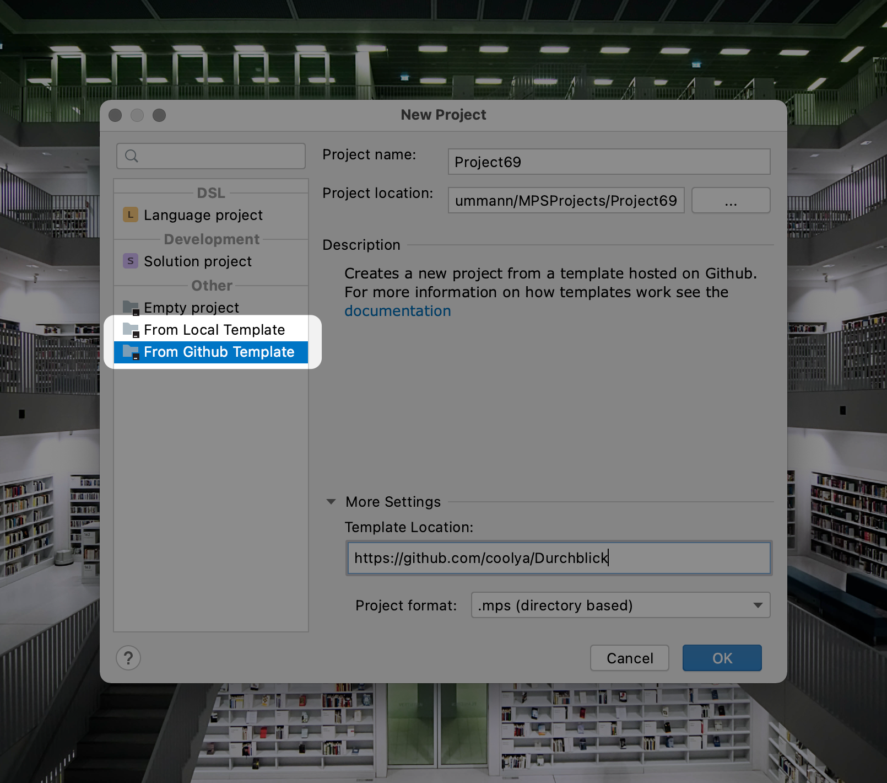

# Lochkarte
A project template plugin for JetBrains Meta Programming System (MPS) which allows you to create new projects from local
or GitHub hosted templates. 

## How to use?

Lochkarte is currently beta and not yet on the JetBrains Marketplace. This will eventually change when the plugin gets a stable release.
For now, you will have to install the plugin manually: go to the [Release](https://github.com/coolya/Lochkarte/releases) section, download the plugin for your MPS version (2020.2 and 2020.3 are currently supported),
then install the zip file via the "Plugins" preferences of MPS. 

**Disclaimer: Lochkarte is currently in beta. The plugin is dealing with local files, while extremely unlikely, bugs could potentially cause data loss on your machine. 
The plugin has undergone testing mostly on macOS and a little on Windows. Especially usage scenarios involving filesystem level links are completely untested and might 
yield very unexpected results. For known issues and limitations see the [Issues](https://github.com/coolya/Lochkarte/issues) list.**

After a restart of MPS you will see two new options in the "New Project" dialog: 

**From Local Template**: Create new project from a template stored on your machine. This option take a path to the
template as a parameter.

**From GitHub Template**: Create new project from a template hosted on GitHub. Templates are just normal repositories nothing special 
required to do on the GitHub side. This option takes an url to a repository as parameter. You can point it to the root repository url like 
`https://github.com/coolya/Durchblick` or even to a specific branch `https://github.com/coolya/Durchblick/tree/release`. As part of the 
project creation process the source code of the repository is downloaded. The repository will **not** be cloned as a git repository, you will 
need to create a new repository in the project folder and commit after the project is created.

### Reporting Problems

When you encounter problems with the plugin please create a [new issue](https://github.com/coolya/Lochkarte/issues/new) in this repository. Please attach
your MPS logfile to the issue if possible. You can find the logs via `Help -> Show Log in Finder/Explorer`. Be aware the logfile is a rolling log that 
might leak information. If you are unsure if it contains information you don't want on the internet, shutdown MPS, delete the file, restart MPS, reproduce the
problem and then upload the file.

## Why?

Why do I need a special plugin for a project templates, can't I just copy my project on the file system? Not really. 
Yes you can create a template and then just copy the files around, but it has some serious side effects. 
The problem with this approach is that MPS models and modules (language/solution) have ids associated with them and MPS 
uses these ids to identify the model or module. If MPS sees two models or modules with the same id it thinks they are the same. 
This means if you copy your template twice you can't open both of the copies in MPS at the same time, 
only the one you open first will be visible. When you open the second copy, MPS will not load any of the content because 
it thinks it has already loaded them. This might not look like a big problem in the first place but can be a real pain in the long run. 

MPS uses these ids all over the place e.g. to store references between nodes and duplicate ids can have bad side effects,
and you want to avoid this at all cost. 

This plugin allows you to use a normal MPS project as a template. The plugin takes care of creating a copy of the template 
and making sure all models and modules get unique ids. 

## Templates

Templates are just normal MPS projects. You don't need to do anything special to make a project a template. 
The plugin will copy the complete content of the template including the files that aren't part of the MPS project itself 
e.g. build scripts and readme. During copying the project some files are ignored: 

- everything under `.git` because we don't want to copy the git repository 
- `workspace.xml` contains the state of the project e.g. open editors etc.
- `modules.xml` contains the content of the project, we will create a new one as part of the project creation.

### Hosted Templates

In addition to using local projects as a template, hosting templates on Github is supported. Github Enterprise is also 
supported but not tested much. Only repositories that do not require authentication are supported, that means no private
repositories or Github Enterprise instances with mandatory authentication. 

If you want to use such a repository as a template you can clone the repository yourself and then use it as a local template.

### Macros

The plugin has very basic support for using macros within the template. Macros are replaced with their value after the
file has been copied into the project.

Supported macros are: 

- `%%project-name%%`: replaced with the name of the project chosen by the users.

Macros are only replaced in text files. Currently, supported file types are:

- gradle scripts: `*.gradle`, `*.gradle.kts`
- Java: `*.java`
- C: `*.c`, `*.h`
- C++: `.C`,`.cc`, `.cpp`,`.cxx`,`.c++`,`.h`,`.H`,`.hh`,`.hpp`,`.hxx`,`.h++`
- C#: `.cs`, `.csx`
- F#: `fs`, `.fsx`
- html: `*.html`, `*.htm`
- Markdown: `*.md`, `*.markdown`
- XML: `.xml` 

While Lochkarte tries to detect the encoding of the files before opening and replacing the macro, it works best with
Unicode (UTF-8/UTF-16) files.

### Limitations

When using the "New Project" or "New Language" dialog with the "create sandbox/runtime" option MPS will create these
solutions below the language folder. Projects with this layout aren't supported because it causes lots of problems when
updating the ids. What happens during project creation behind the scenes is, create a copy of the original module, 
delete the original and then rename the copy to the original name. This is required because changing the descriptor, which contain the id,
after a module has been loaded doesn't work. During the renaming and deletion handling nested solutions in the language folder
doesn't work.

If the template contains any `DevKit`s these aren't handled at all and will produce duplicate 
ids for the `DevKit`. See #5